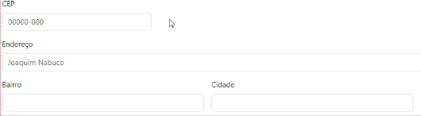
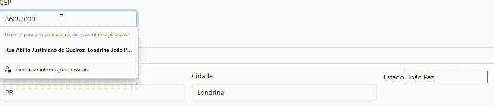
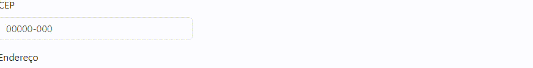
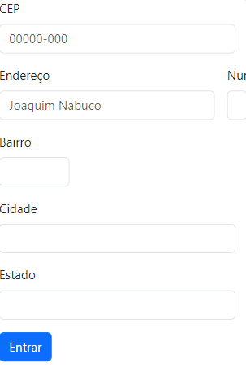

# 📂indice

[Face do site](#face-do-site)  
[Funcionalidades](#funcionalidades) 
[oque foi feito](#oque-foi-feito)  
[🔗Fontes usadas](#fontes-usadas)  

## Face do site

## funcionalidades

### barra de texto do CEP possui 3 funcionalidades

1°-Se digitar o CEP ele altomaticamente reescreve os outros campos

 

2°Se voce selecionar o campo de texto do CEP e desseleciona sem escrever nada, ele da como se o CEP estiesse errado

3°-Se você digitar o CEP errado ele da como incorreto:

## oque foi feito

19/09: Criei um arquivo html, ultilizei link do boosttrap para tornar meu cite usavel até para aparelhos telefones e peguei a cara do site de um site do boostrap.

20/09: Arrumei algumas partes da face do site.

22/09: Arrumei a posição dos quadros de digitação para aparentar mais uma tela de cadastro:

26/09: criei um arquivo javascript e add alguns codigos e add a const eNumero e a limparFormulario.

03/10: Adicionei ao Javascript alguns comandos ordenados dentro de algumas anotações, entre elas:

- limpar formulario 

tambem add a const limparFormulario

add a const preencherFormulario

ultilizei o test
O método test() executa uma busca por uma correspondência entre uma expressão regular e uma string. Retorna true ou false.
- preenche campos do formulario

- verifica se o cep é valido

- função para consumo de API ultilizando a função do tipo assincrona

Usando Fetch
A API Fetch fornece uma interface JavaScript para acessar e manipular partes do pipeline HTTP, tais como os pedidos e respostas. Ela também fornece o método global fetch() (en-US) que fornece uma maneira fácil e lógica para buscar recursos de forma assíncrona através da rede.

- add um comentario DOM, no input CEP

ultilizei o focusout. 
 focusout é acionado quando um elemento perde o foco, após o blurevento. Os dois eventos diferem porque focusoutbolhas, enquanto blurnão.

e add isso com os comandos o site chegou nesse resultado:

## 🔗Fontes usadas
* Boostrap  
  
[Link](https://getbootstrap.com/docs/5.0/forms/layout/)

* javascript  
 

* Html  
 

* VScode  
 

* Chrome  
 
